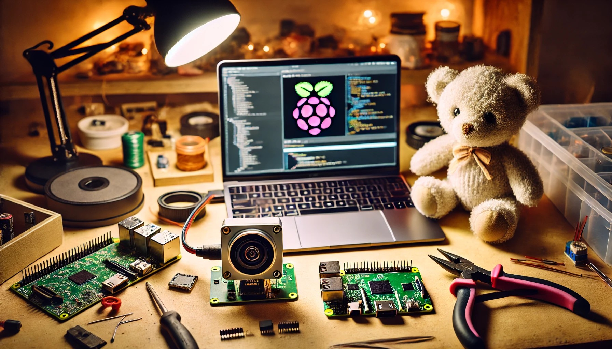

# 🧸 Raspberry Pi Zero 2 W & AI Camera - Plush Toy Recognition

## 📌 Project Overview
This project uses a **Raspberry Pi Zero 2 W** and an **AI camera module** to recognize plush toys using **TensorFlow Lite**. The goal is to create an interactive system that identifies different stuffed animals and provides real-time feedback.

## 🛠️ Features
- 📷 **AI-powered plush toy recognition** using a camera module
- 🚀 **Lightweight setup** with Raspberry Pi OS Lite (64bit)
- 🧠 **Machine learning integration** with Raspberry Pi AI Camera and TensorFlow Lite
- 🔧 **DIY-friendly project** for home AI experiments

---

## 🏗️ Setup Instructions

### 1️⃣ **Hardware Requirements**
| Component | Description |
|-----------|------------|
| Raspberry Pi Zero 2 W | Small and power-efficient SBC |
| Raspberry Pi AI Camera | AI-powered image recognition |
| Host Machine | Machine to connect to raspi and for model training |

### 2️⃣ **Setup Raspberry Pi with Camera**

### 3️⃣ **Collect Data for Model Training**

### 4️⃣ **Re-train AI Model with Custom Dataset**

### 5️⃣ **Quantize and Convert Model for AI Camera**

### **Deploy Model**

### 📜 References

* [Rapberry Pi AI Camera](https://www.raspberrypi.com/documentation/accessories/ai-camera.html)

